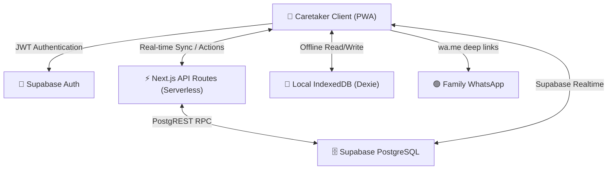

<div align="center">
  
  
  # 🪷 SevaCare
  **Next-Generation Elder Care Management Platform**
  
  <p>
    <a href="https://nextjs.org/"></a>
    <a href="https://supabase.com/"></a>
    <a href="https://tailwindcss.com/"></a>
    <a href="https://www.typescriptlang.org/"></a>
    <a href="https://react.dev/"></a>
  </p>
  
  <p>
    <em>A modern, offline-first PWA designed to digitize old age home workflows, ensuring uncompromising resident well-being through real-time telemetry, automated reminders, and seamless family communication.</em>
  </p>
</div>

---

## 📑 Table of Contents
- [🎯 The Problem We Solve](#-the-problem-we-solve)
- [✨ Core Capabilities](#-core-capabilities)
- [🏗️ System Architecture](#️-system-architecture)
- [🛠️ Tech Stack](#️-tech-stack)
- [📁 Project Structure](#-project-structure)
- [🚀 Quick Start (Local Development)](#-quick-start-local-development)
- [🔒 Security & Compliance](#-security--compliance)
- [🤝 Contributing](#-contributing)

---

## 🎯 The Problem We Solve

Elder care facilities frequently suffer from fragmented data, relying heavily on physical registers. This leads to missed medication schedules, delayed emergency responses, and a lack of transparency for families. 

**SevaCare** fundamentally transforms this paradigm by providing a unified, tablet-optimized interface for caretakers to log vitals, track prescriptions, monitor engagement, and trigger immediate alerts—all designed with psychological safety and strict security in mind.

---

## ✨ Core Capabilities

### 🩺 Comprehensive Medical Telemetry
- **Rich Resident Profiles:** Immutable records of medical history, life-threatening allergies, and granular mobility status.
- **Dynamic Vitals Logging:** Real-time forms tracking BP, heart rate, blood sugar, and SPO2, with visual indicators for critical deviations.
- **Prescription Engine:** Automated action center highlighting overdue and upcoming dosages.

### 🌐 Offline-First & Resilient (PWA)
- Built with **Dexie** (IndexedDB) and Service Workers (`sw.js`).
- Caretakers can log critically important data even during network outages. The system automatically reconciles with Supabase upon reconnection via the `SyncStatusIndicator`.

### 🌍 Built for Global Accessibility
- Full **Internationalization (i18n)** support baked natively into the platform (`lib/translations.ts`).
- Language toggles across the UI ensure staff from different regions can seamlessly interact with the tool.

### 🧘 Gamified Wellness & Activity Hub
- Carefully curated, low-impact exercise modules specifically engineered for senior citizens.
- Guided distraction-free mode with progress tracking to foster a sense of accomplishment and combat isolation.

### 🚨 Real-Time Event Driven Alerts
- Immediate escalation paths for medical, fall, or wandering emergencies.
- One-click Web-to-WhatsApp routing to bridge the communication gap between facility caretakers and families.

---

## 🏗️ System Architecture

SevaCare leverages a decoupled, serverless architecture optimized for edge delivery and instantaneous state sync.



---

## 🛠️ Tech Stack

### Frontend Ecosystem
- **Framework:** Next.js 16 (App Router)
- **UI Architecture:** React 19, Server Components (RSC)
- **Styling:** Tailwind CSS v4, Radix UI Primitives, `shadcn/ui`
- **State & Forms:** React Hook Form + Zod validation
- **Offline Storage:** Dexie.js (IndexedDB wrapper)
- **Data Viz & Export:** Recharts, jsPDF

### Backend & Infrastructure
- **BaaS:** Supabase
- **Database:** PostgreSQL (with Row Level Security)
- **Deployment:** Vercel / Edge Network

---

## 📁 Project Structure

```text
sevacare/
├── db/                         # Raw SQL migrations (001 to 007)
├── frontend/
│   ├── app/                    # Next.js App Router root
│   │   ├── api/                # Serverless handlers (auth, logging)
│   │   ├── dashboard/          # Protected caretaker interfaces
│   │   │   ├── activity/       # Wellness & Gamification engine
│   │   │   ├── residents/      # CRUD for patient census
│   │   │   └── reminders/      # Medication & Task queue
│   │   └── offline/            # PWA fallback states
│   ├── components/             # Dumb & Smart UI components
│   │   └── ui/                 # Radix/Tailwind design system
│   ├── lib/                    # Core business logic & clients
│   │   ├── supabase/           # Server/Client auth wrappers
│   │   ├── translations.ts     # i18n dictionaries
│   │   └── offline-db.ts       # Dexie local state management
│   └── public/                 # Static assets & Manifests
└── DEPLOYMENT_GUIDE.md         # Infrastructure setup protocols
```

---

## 🚀 Quick Start (Local Development)

### Prerequisites
- Node.js (v18.x or higher)
- npm or pnpm
- A Supabase Project

### 1. Database Setup
Execute the SQL files located in the `db/` directory strictly in numerical order within your Supabase SQL Editor to establish the required schemas and Row Level Security (RLS) policies.

### 2. Environment Variables
Clone the `.env.example` file to create your localized secrets configuration:

```bash
cd frontend
cp .env.example .env.local
```
Populate the file with your Supabase credentials:
```env
NEXT_PUBLIC_SUPABASE_URL=your_project_url
NEXT_PUBLIC_SUPABASE_ANON_KEY=your_anon_key
```

### 3. Install & Run
```bash
npm install
npm run dev
```
The application will be hot-reloading at `http://localhost:3000`.

---

## 🔒 Security & Compliance

- **Authentication:** Managed entirely via Supabase Auth (Secure JWTs).
- **Data Governance:** Strict PostgreSQL Row Level Security (RLS) policies ensure multi-tenant data isolation; authenticated sessions can only access authorized facility parameters.
- **Edge Validation:** Zod schemas guarantee type safety boundaries between the client and serverless functions.

---

## 🤝 Contributing

We welcome contributions from the open-source community to build better tooling for elder care. 

1. Fork the Project
2. Create your Feature Branch (`git checkout -b feature/AmazingFeature`)
3. Commit your Changes (`git commit -m 'feat: Add some AmazingFeature'`)
4. Push to the Branch (`git push origin feature/AmazingFeature`)
5. Open a Pull Request

---
<div align="center">
  <p>Engineered with care 💙 to improve lives.</p>
</div>
