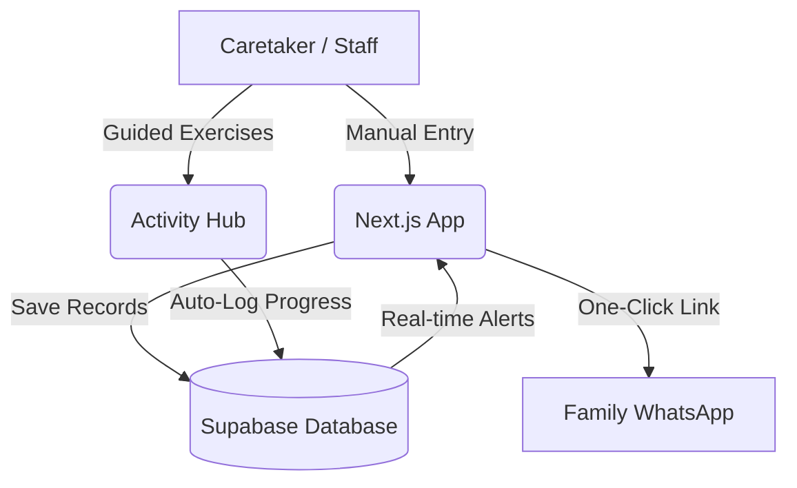

# 🪷 SevaCare — Elder Care Management Platform

SevaCare is a web application designed to simplify and improve the daily management of old age homes. By digitizing workflows and prioritizing resident well-being, it provides caretakers with the tools they need to ensure a high quality of life for the elderly.

## 🎯 How It Solves Real-World Problems

Managing an old age home often involves overwhelming paperwork, scattered medical records, and the challenge of keeping residents engaged. SevaCare addresses these practical challenges directly:

* **Eliminates Manual Paperwork:** Replaces easily lost physical registers with secure, searchable digital profiles for every resident.
* **Prevents Missed Medications:** Automated reminders ensure caretakers always know when a resident needs their daily medication.
* **Combats Inactivity & Isolation:** Provides a dedicated Activity Hub with guided, senior-friendly exercises to promote physical and mental health.
* **Improves Emergency Response:** Keeps critical medical data (like allergies and mobility risks) instantly accessible in crucial moments.
* **Keeps Families Connected:** Allows staff to send instant health and mood updates to family members via WhatsApp, building trust and transparency.

## 📱 Core Features

### 👨‍⚕️ Caretaker Dashboard & Resident Management
* **Action Center:** A central dashboard that automatically highlights upcoming or overdue medication doses.
* **Detailed Resident Profiles:** Secure records containing medical history, dietary needs, life-threatening allergies, and wandering risks.
* **Daily Status Logging:** Quick, mobile-friendly forms for staff to log daily vitals, food intake, and mood.

### 🧘‍♀️ Wellness & Activity Hub
*   **Curated Senior Exercises:** Low-impact workouts tailored for the elderly (e.g., Seated Yoga, Deep Breathing).
*   **Guided Play Mode:** A distraction-free, easy-to-follow interface with a large visible timer that guides residents through exercises step-by-step.
*   **Progress Tracking:** Records completed activities and builds daily streaks to motivate consistent physical engagement.

## 🏗️ Application Architecture

SevaCare is designed to be lightweight and fast. It follows a direct flow from data entry to storage and communication:



*   **User Interface:** A responsive web dashboard that works on tablets and mobiles.
*   **Data & Auth:** Supabase handles secure logins and stores all resident medical data.
*   **Communication Layer:** Uses standardized `wa.me` links to bridge the gap between facility records and family communication instantly.

## 📁 Project Structure

A clean, modular structure ensures the app is easy to maintain and scale:

```text
NEWIOLDAGEHOME/
├── db/                       # Database Setup
│   └── *.sql                 # Database schemas (vitals, meds, activity)
├── frontend/                 # Core Application
│   ├── app/                  # Pages & Routing
│   │   ├── dashboard/        # Main caretaker interface
│   │   │   ├── activity/     # Exercise & Gamification hub
│   │   │   ├── residents/    # Resident management (Add/Edit/View)
│   │   │   └── reminders/    # Medicine Action Center
│   │   └── api/              # Server-side logic (e.g., Auth, Logging)
│   ├── components/           # Reusable UI Elements
│   │   └── ui/               # Base design system (Buttons, Cards, Forms)
│   └── lib/                  # Helper utilities & Database Clients
└── README.md                 # Project Overview
```

## 🛠️ How It Works (Technology)
SevaCare is built with a simple, modern architecture optimized for ease of use by non-technical care staff. It features a calming, accessible design that works seamlessly on both mobile phones (for on-the-go nurses) and desktop computers (for administrators). 

*   **Frontend:** Next.js and Tailwind CSS (delivering a fast, mobile-friendly experience)
*   **Backend & Database:** Supabase (ensuring secure and reliable data storage)

## 🚀 Quick Start & Deployment

For step-by-step instructions on setting up SevaCare on your own systems (using Vercel and Supabase), please refer to the **[DEPLOYMENT_GUIDE.md](./DEPLOYMENT_GUIDE.md)** included in this repository.

1. Set up your Supabase project and run the database setup queries found in the `db/` folder.
2. Add your database credentials to a `frontend/.env.local` file.
3. Run `npm install` followed by `npm run dev` in the `frontend/` directory to start the application locally.
