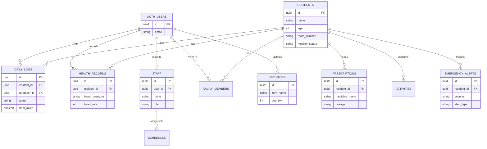
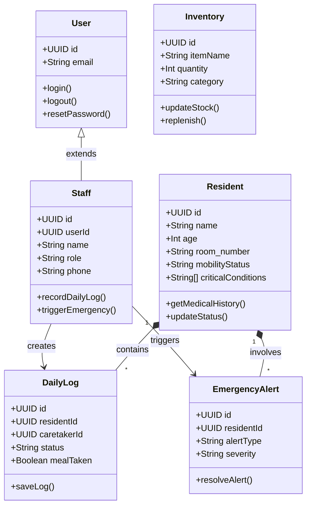
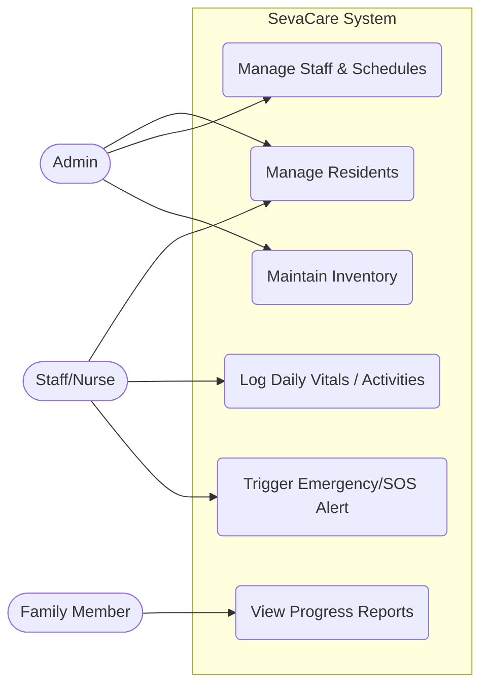

# SevaCare Project Documentation (Sections 1.11.1 to 1.12)

Here is the detailed documentation for the sections you requested. You can copy the text and diagrams directly into your project report. 

## 1.11 Design

### 1.11.1 Entity Relationship Diagram
The Entity-Relationship (ER) diagram illustrates the relationship between the core entities in the SevaCare system. The architecture relies on Supabase Auth for user management, with interconnected entities for residents, medical records, and staff.

### 1.11.2 Class Diagram
The Class diagram represents the object-oriented structure of the backend models and frontend data interfaces. It defines the properties, methods, and inheritances of the core system components.

### 1.11.3 Use Case Diagram
The Use Case diagram dictates the interactions between external actors (users acting in different roles) and the system boundaries. 

* **Admin:** Overlooks the facility, manages staff, and tracks inventory levels.
* **Staff (Nurse/Caretaker):** Interacts directly with residents, logging vitals and triggering SOS alerts when needed.
* **Family Member:** Receives updates, monitors resident wellbeing and receives automated notifications.

---

## 1.12 Database Design
The application utilizes a PostgreSQL relational database structured via Supabase. Below is the comprehensive data dictionary denoting the physical schema layout.

### Table: `residents`
Stores baseline demographic and physical status information for the old age home residents.
* `id` (UUID, Primary Key)
* `name` (TEXT, Not Null)
* `age` (INTEGER, Not Null)
* `room_number` (TEXT)
* `mobility_status` (TEXT) - Independent, Assisted, or Bedridden
* `critical_conditions` (TEXT Array)
* `created_at` (TIMESTAMPTZ)

### Table: `daily_logs`
Tracks qualitative day-to-day observations managed by caretakers.
* `id` (UUID, Primary Key)
* `resident_id` (UUID, Foreign Key) -> `residents.id`
* `caretaker_id` (UUID, Foreign Key) -> `auth.users.id`
* `status` (TEXT) - good, fair, poor, critical
* `meal_taken` (BOOLEAN)
* `medication_taken` (BOOLEAN)
* `mood` (TEXT)
* `logged_at` (TIMESTAMPTZ)

### Table: `health_records`
Detailed logs of physiological metrics / vitals.
* `id` (UUID, Primary Key)
* `resident_id` (UUID, Foreign Key) -> `residents.id`
* `blood_pressure` (TEXT)
* `heart_rate` (INTEGER)
* `temperature` (DECIMAL)
* `blood_sugar` (DECIMAL)
* `recorded_at` (TIMESTAMPTZ)

### Table: `emergency_alerts`
Logs system SOS triggers mapped to individual residents.
* `id` (UUID, Primary Key)
* `resident_id` (UUID, Foreign Key) -> `residents.id`
* `alert_type` (TEXT) - medical, fall, fire, etc.
* `severity` (TEXT) - low, medium, high, critical
* `resolved` (BOOLEAN)
* `triggered_by` (UUID, Foreign Key) -> `auth.users.id`

### Table: `inventory`
Manages supplies like medications and medical equipment.
* `id` (UUID, Primary Key)
* `item_name` (TEXT, Not Null)
* `category` (TEXT) - medicine, equipment, supplies
* `quantity` (INTEGER)
* `min_threshold` (INTEGER)
* `updated_by` (UUID, Foreign Key) -> `auth.users.id`

### Table: `staff`
Stores metadata regarding caretakers, doctors, and general workers.
* `id` (UUID, Primary Key)
* `user_id` (UUID, Foreign Key) -> `auth.users.id`
* `name` (TEXT, Not Null)
* `role` (TEXT) - nurse, caretaker, doctor, admin
* `phone` (TEXT)
* `is_active` (BOOLEAN)
